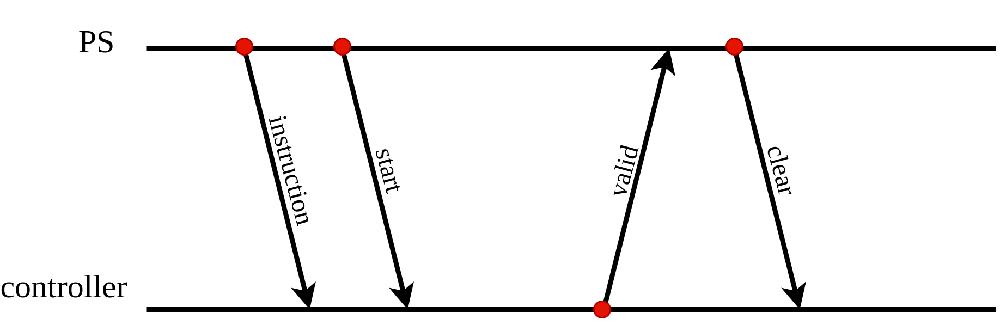

# FPGA-DSP

> 2022 Spring NCKU FPGA Course
>
> Homework 5
>
> E24076239 E24076297 E24076750

## Problem1

### Description

This project uses **ZYNQ processor**, **block RAM**, and **DSP module** to implement a simple computing system.

### Modules

* **controller**

  * Receiving `instructions_i` from axi_gpio_0 and `start_i` from axi_gpio_1

  * States

    * `IDLE`: resetting `counter` to zero. If `start_i` pulls high, going to state `DECODE`

    * `DECODE`:

      * decoding the 32-bit inputs `instruction_i` using the following specification and outputting the decoded results

          |                                        31 | 30:27       | 26:20      | 19:15      | 14:10            | 9:5              | 4:0              |
          | ----------------------------------------: | ----------- | ---------- | ---------- | ---------------- | ---------------- | ---------------- |
          | `bram1_web_o` & `bram1_eb_o` & `bram0_reb_o` | `alumode_o` | `opmode_o` | `inmode_o` | `bram1_w_addr_o` | `bram1_r_addr_o` | `bram0_r_addr_o` |

      * Going to  state `EXECUTE` state

    * `EXECUTE`:

      * Using `counter` to count the execution cycles of current instruction
      * Going to state `DONE`

    * `DONE`

      * Pulling `valid_o` to high
      * Going to state `IDLE` while `start_i` is low

* pipeline_reg

  * Using 3 levels pipeline registers to hold the value of `bram1_web_i` and  `bram1_w_addr_i`, which are connected to the outputs of controller

* mux5

  * inputs:

    * `sel_i`: connected to `bram1_web_o[4:0]` of pipeline_reg

    * `w_addr_i[4:0]` : connected to `bram1_w_addr_o[4:0]` of pipeline_reg
    * `r_addr_i[4:0]`: connected to `bram1_r_addr_o[4:0]` of controller

  * output: 

    * `addr_o[4:0]`: connected to `addr_b[4:0]` of BRAM1

  * Outputs `w_addr_i[4:0]` if `sel_i` is high, otherwise outputs `r_addr_i[4:0]`

* BRAMs

  * BRAM0: written by CPU via Port A; read out by Controller via Port B and sent to Input A of DSP

  * BRAM1: Read and write by the CPU via Port A; read out the Input B sent to the DSP by the Controller via Port B, and write the operation result of the DSP

  * Specification of BRAMs:

    |                   | BRAM0 | BRAM1 |
    | ----------------- | ----- | ----- |
    | **Block Memory Size** | 32kb | 32kb |
    | **RAM mode** | TDP | TDP |
    | **READ_WIDTH_A** | 0 | 36 |
    | **READ_WIDTH_B** | 36 | 36 |
    | **WRITE_WIDTH_A** | 36 | 36 |
    | **WRITE_WIDTH_B** | 0 | 36 |
    | **WRITE_MODE_A** | WRITE_FIRST | WRITE_FIRST |
    | **WRITE_MODE_B** | WRITE_FIRST | WRITE_FIRST |

* dsp_direct

  * Data input: A & B

  * Data output: P

  * Specification

    | Attribute | Value |
    | -------- | ---- |
    | **AREG** | 1    |
    | **BREG** | 1 |
    | **PREG** | 1 |
    | **ALUMODEREG** | 1 |
    | **INMODEREG** | 1 |
    | **OPMODEREG** | 1 |

## Communication

Below are more detailed descriptions of the communication and behavior of PS and controller. 

| PS                  | controller      |
| ------------------- | --------------- |
| Send an instruction | In state `IDLE` |
| Send a start signal |  |
| |  Receives the start signal from PS, then enters the `decode` state |
| |  Decode the instruction, then enters the `EXECUTE` state |
|                     | Waits for DSP to finish the execution |
| | Enter the `DONE` state, then sends a valid signal to PS |
| Receive the valid signal from controller | |
| Sends a clear signal | Returns to the `IDLE` state |

## Problem

Question: How many DSP48E1 are on PYNQ-Z2?

Answer: **220**